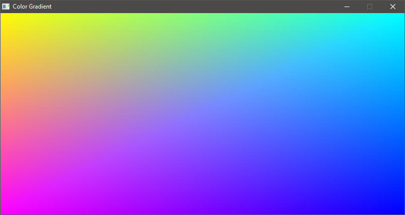

# canvas

`cv` is an esoteric, dynamic, pseudo-functional, programming/scripting language designed with expressiveness and hackability in mind. It's heavily inspired by JavaScript, LISP with a little bit of Python.

Here are some of the standard operators for canvas:
[Standard Operators](./docs/Spec.md).

Short summary:

- Code only supports ASCII (no unicode or emojis)
- Garbage collected through reference counting (Using C++'s std::memory for now)
- Prefix Notation
- No classes
- Objects are defined by the `proto` operator.
- Similarly to LISP, it tries to treat everything as a list.
- Strings are only formed with single quotes `'EXAMPLE'`
- It's primarily intepreted, but later on it will feature a way to compile into binary (cv code -> C code -> [COMPILER] -> Binary)
- Objects are contexts themselves

`cv` expression structure
```
[OPERATOR(:~|)MEMBER/MODIFIER ARGUMENTS]
```

Every statement must start an operator otherwise the statement is interpreted as natural type (List, Number, etc)

## Why?

This is rather a toy project for me to learn. I don't expect it to become anything serious. However I'm considering using it as en extension interface for other projects.

## Examples

- Using standard drawing library `brush`

Drawing a red circle


```
set width 200
set height 100

set mod [math:sqrt [+ [math:pow width 2] [math:pow height 2]]]
rset mod [* mod 0.1]

cv:window-create 'Red Circle' width height 4 4
do [cv:running] [
    [cv:step]
    [cv:clear]
    [
        iter [.. 0 360 1]~an [
            [set x [+ [* mod [math:sin an]] [* width 0.5]]]
            [set y [+ [* mod [math:cos an]] [* height 0.5]]]
            [cv:d-pixel x y [1 0 0 1]]
        ]
    ]
    [cv:draw]
]
```


Nice looking gradient


```
set width 200
set height 100

cv:window-create 'Color Gradient' width height 4 4
do [cv:running] [
    [cv:step]
    [cv:clear]
    [
        iter [.. 0 [- width 1] 1]~x [
            iter [.. 0 [- height 1] 1]~y [
                [set r [/ [+ x 1] width]]
                [set g [/ [+ y 1] height]]
                [cv:d-pixel x y [[- 1 r] [- 1 g] [math:clamp [+ r g] 0 1] 1]]
            ]
        ]
    ]
    [cv:draw]
]
```


Pong game written entirely in canvas
[](https://www.youtube.com/watch?v=evJFDksSCQ0)

```
set ratio [/ 16 9]
set g-height 100
set g-width [* g-height ratio]

set p-width 10
set p-height [* g-height 0.25]

set b-width 4
set b-height 4

set state 1
set last-state time:epoch

set check-collision [fn [p bx by][
    [set hb-w [/ b-width 2]]
    [set hb-h [/ b-height 2]]  

    [if
            [or
                [and [gte [+ bx hb-w] p:x] [gte [+ by hb-h] p:y] [lt [- bx hb-w] [+ p:x p-width]] [lt [- by hb-h] [+ p:y p-height]]]
                [and [lte [- bx hb-w] [+ p:x p-width]] [lte [- by hb-h] [+ p:y p-height]] [gt [- bx hb-w] p:x] [gt [- by hb-h] p:y]]
            ]
        [
        ret 1
    ]]
    [ret 0]
]]

set c-player [fn [pcolor][
    proto
    x:0
    y:0
    score:0
    color:pcolor
    move:[fn [y][
        [if [gte [+ y _:y p-height] g-height][
            [rset _:y [- g-height p-height 1]]
            [ret]
        ]]
        [if [lte [- _:y y] 0][
            [rset _:y 1]
            [ret]
        ]]
        [rset _:y [+ y _:y]]
        [if [check-collision _ ball:x ball:y][
            [if [lt y 0][
                [if [lt [+ ball:y y] 0][
                    [rset ball:y [/ b-height 2]]
                    [rset _:y b-height]
                ][
                    [rset ball:y [+ ball:y y]]
                ]]
            ]]
            [if [gt y 0][
                [if [gt [+ ball:y y] g-height][
                    [rset ball:y [- g-height [/ b-height 2]]]
                    [rset _:y [- g-height p-height b-height]]
                ][
                    [rset ball:y [+ ball:y y]]
                ]]                
            ]] 
            [if [lt _:x ball:x][
                [rset ball:xspeed [math:rand-int 150 250]]
            ]]
            [if [gt _:x ball:x][
                [rset ball:xspeed [math:rand-int -250 -150]]
            ]]            
            [rset ball:yspeed [+ ball:yspeed [* y 100]]]
        ]]
    ]]
    set:[fn [x y][
        [rset _:x x]
        [rset _:y y]
    ]]
    draw:[fn [][
        [cv:d-rectangle _:x _:y p-width p-height 1 _:color]
    ]]
]]

set c-ball [fn [][
    proto
    x:0
    y:0
    xspeed:0
    yspeed:0
    move:[fn [][
        [set xdiff [+ _:x [* _:xspeed cv:ticks]]]
        [set ydiff [+ _:y [* _:yspeed cv:ticks]]] 

        [if [or [gte [+ ydiff [/ b-height 2]] g-height] [or [check-collision p1 _:x ydiff] [check-collision p2 _:x ydiff]]~pc][
            [rset ydiff _:y]
            [rset _:yspeed [* _:yspeed -1]]
        ]]

        [if [or [lte [- ydiff [/ b-height 2]] 0] [or [check-collision p1 _:x ydiff] [check-collision p2 _:x ydiff]]~pc][
            [rset ydiff _:y]
            [rset _:yspeed [* _:yspeed -1]] 
        ]] 

        [if [or [gte [+ xdiff [/ b-width 2]] g-width] [or [check-collision p1 xdiff _:y] [check-collision p2 xdiff _:y]]~pc][
            [rset xdiff _:x]
            [rset _:xspeed [* _:xspeed -1]]    
            [if [eq pc 0][
                [set-goal 1]
            ]]                 
        ]]

        [if [or [lte [- xdiff [/ b-width 2]] 0] [or [check-collision p1 xdiff _:y] [check-collision p2 xdiff _:y]]~pc][
            [rset xdiff _:x]
            [rset _:xspeed [* _:xspeed -1]]
            [if [eq pc 0][
                [set-goal -1]
            ]]             
        ]]                 

        [rset _:x xdiff]
        [rset _:y ydiff]
    ]]
    throw:[fn [][
        [set dir [if [gt [math:rand-int 0 1] 0][ret -1][ret 1]]]
        [rset _:xspeed [* 150 dir]]
        [rset _:yspeed [math:rand-int -35 35]]
    ]]
    set:[fn [x y][
        [rset _:x x]
        [rset _:y y]        
        [rset _:xspeed 0]
        [rset _:yspeed 0]
    ]]
    draw:[fn [][
        [cv:d-rectangle [- _:x [* b-width 0.5]] [- _:y [* b-height 0.5]] [b-width] [b-height] 1 [0 0 1 1]]
    ]]    
]]

set p1 [c-player [1 0 0 1]]
set p2 [c-player [0 1 0 1]]
set ball [c-ball]

set set-state [fn [v][
    [rset state v]
    [rset last-state tm:epoch]
]]

set set-goal [fn [v][
    [if [eq v -1][
        [++ p2:score]
    ]]
    [if [eq v 1][
        [++ p1:score]
    ]]
    [set-state 0]   
]]

set-state 0

set check-state [fn [][
    [if [eq state 0][
        [p1:set 0 [- [/ g-height 2] [/ p-height 2]]]
        [p2:set [- g-width p-width] [- [/ g-height 2] [/ p-height 2]]]
        [ball:set [* g-width 0.5] [* g-height 0.5]]
        [cv:set-title [s-join 'P1 Score ' p1:score ' | P2 Score ' p2:score]]        
        [set-state 1]
    ]]

    [if [and [eq state 1] [gt [- tm:epoch last-state] 1]][
        [set-state 2]
    ]]    

    [if [and [eq state 2] [gt [- tm:epoch last-state] 1]][
        [ball:throw]
        [set-state 3]
    ]]    
]]

cv:window-create 'PONG' g-width g-height 4 4
do [cv:running] [
    [cv:step]
    [cv:clear]
    [   
        [check-state]
        [if [eq state 3][
            [ball:move]
            [if [cv:kb-check cv:key-W][
                [p1:move [* cv:ticks -100]]
            ]]
            [if [cv:kb-check cv:key-S][
                [p1:move [* cv:ticks 100]]
            ]]  
            [if [lt [+ p2:y [/ p-height 2]] ball:y][
                [p2:move [* cv:ticks 100]]
            ]]
            [if [gt p2:y ball:y][
                [p2:move [* cv:ticks -100]]
            ]]
        ]]
        [p1:draw]
        [p2:draw]
        [ball:draw]
    ]
    [cv:draw]
]
```

## Modifiers
canvas offers a way to access or modify operators/imperatives through the following tokens:
- `:`: It's the access modifier. It allows to access members such as functions or variables within an object.
- `~`: It's called the namer modifier. It allows to rename an object on the fly and usually temporarily. The namer modifier talks to the nearest non-temporary context (root, within a proto or non-anymous functions) and makes it available through the given name. The namer can even be used to declare variables instead of `set`.
- `|`: It's called the parralel linker modifier. It allows to link two contexts concurrently but in sequence. It's useful for threaded code


## Libraries

Libraries can be imported by using the statement `[import "library-name"]`. The interpreter will look for a file named `library-name` locally. If not found, then it will check the libraries installed in `/usr/lib/cv/`. if not found, the interpreter will either throw a warning and continue or stop the program's execution (depending whether the interpreter was executed with the `--relaxed` argument).