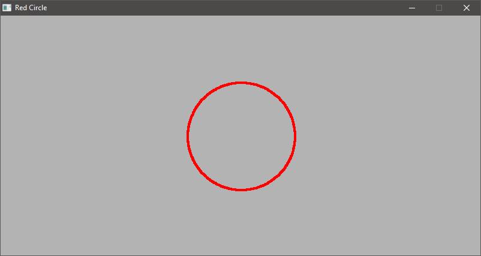

# canvas

# What is it?

`cv` is an esoteric dynamic/pseudo-functional programming language designed with simplicity and hackability in mind. It's heavily inspired by C++ and Javascript, with a very small touch of LISP.

Short summary:

- Code only supports ASCII (no unicode or emojis)
- Garbage collected through reference counting (Using C++'s std::memory for now)
- Prefix Notation
- No classes
- Objects are defined by the `proto` operator.
- Similarly to LISP, it tries to treat everything as a list.
- Strings are only formed with single quotes `'EXAMPLE'`
- It's primarily intepreted, but later on it will feature a way to compile into binary (cv code -> C code -> [COMPILER] -> Binary)
- Objects are contexts themselves

`cv` expression structure
```
[OPERATOR(:~|)MEMBER/MODIFIER ARGUMENTS]
```

Every statement must start an operator otherwise the statement is interpreted as natural type (List, Number, etc)

# Why?

This is rather a toy project, for me to learn. I don't expect it to become anything serious. However I'm considering using as en extension interface for other projects.

# Examples

- Using standard drawing library `brush`

Drawing a red circle


```
set width 200
set height 100
cv:window-create 'Game' width height 4 4

set area [math:sqrt [+ [math:pow width 2] [math:pow height 2]]]
set mod [* area 0.1]

do [cv:running] [
    [cv:step]
    [cv:clear]
    [
        iter [.. 0 360 1]~an [
            [set x [+ [* mod [math:sin an]] [* width 0.5]]]
            [set y [+ [* mod [math:cos an]] [* height 0.5]]]
            [cv:d-pixel x y [1 0 0 1]]
        ]
    ]
    [cv:draw]
]
```

# MEMBER/MODIFIERS
canvas offers a way to access or modify operators/imperatives/references through the following tokens:
- `:`: It's the access modifier. It allows to access members such as functions or variables within an object
- `~`: It's called the namer modifier. It allows to rename an object on the fly and usually temporarily
- `|`: It's called the parralel linker modifier. It allows to link two contexts concurrently but in sequence. It's useful for threaded code


## Libraries

Libraries can be imported by using the statement `[std:import "library-name"]`. The interpreter will look for a file named `library-name` locally. If not found, then it will check the libraries installed in `/usr/lib/cv/`. if not found, the interpreter will either throw a warning and continue or stop the program's execution (depending if the interpreter was executed with the `--relaxed` argument).